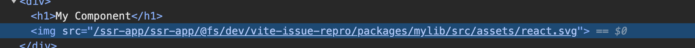

# vite-issue-repro
Reproduction of vite issue with monorepos &amp; assets.

## Steps to reproduce
optional: install [volta](https://volta.sh/)
1. `volta setup`
2. `yarn`
3. `cd apps/app-ssr`
4. `yarn dev`

## Steps used to setup
1. `yarn create vite`
2. use the ssr/react/ts setup
3. add a `base` path
4. setup lib package
